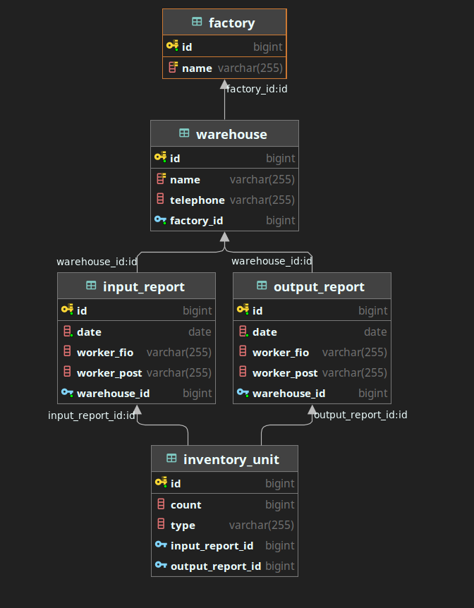
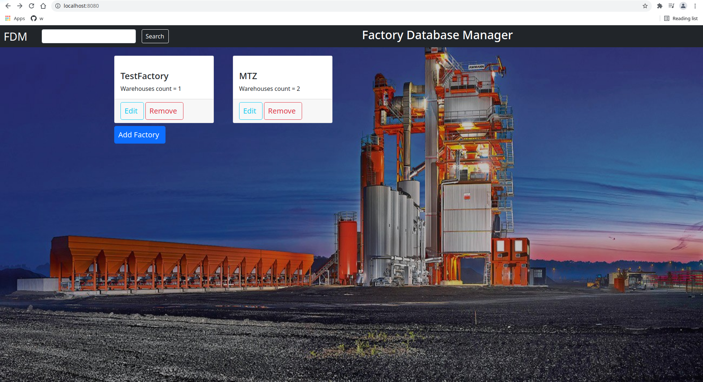

# Factory Database Manager (FDM)
This project is a simple Spring Boot JSP application. 
It provides CRUD operations on Entities with JPA (Hibernate) and display 
result at browser frontend using Servlets. 

## Domain description 
Main manager store factories. Each factory has many warehouses with inventory
(possible inventory types: instruments, suit and other). Each warehouse has unique number,
name, telephone number. Inventory can be added to warehouse with the input consignment note (input inventory report).
Input consignment note has the following structure: date, worker first and second names, worker post, 
list of inventory units (by type) with count of units of each inventory type. 
Inventory can be removed from warehouse with output consignment note. This note has the same structure, 
as the input consignment note.

## Technical Requirements 
* Factories
  * Create factory 
  * Delete factory
  * Edit factory data
  * Add warehouses to factory
  * Remove warehouses from factory
* Warehouses 
  * Create warehouse 
  * Delete warehouse 
  * Edit warehouses data
* Consignment note
  * Create input note
  * Create output note
  * Add inventory to report 
* Additional 
  * All information about adding/removing the inventory (by type)
  * List of all warehouses

## Demonstration 

### Database 

### View 

